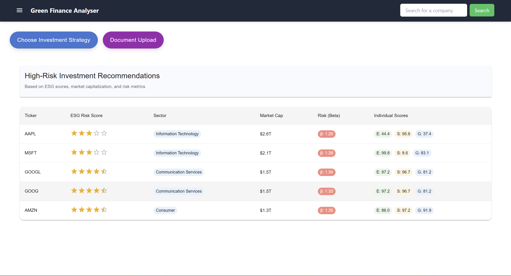

# Cyberpunk

<!-- Desc- Green Finance Optimization Platform (GreenFOP) -->

## Description

This AI-powered platform helps users optimize their financial decisions in a manner that aligns with sustainability goals. The platform delivers personalized recommendations that maximize environmental, social, and governance (ESG) outcomes by leveraging AI, financial data, environmental metrics, and user preferences. 

We address challenges in green finance, the platform provides tools to -

1) Score projects based on sustainability impact, helping using identify opportunities with the highest ESG value.

2) Optimize resource allocation, ensuring efficient investment within budget constraints while prioritizing ESG outcomes.

3) Predict future risks associated with green investments and ROI

## Demo Video

## Sample Images

## Tech Stack

